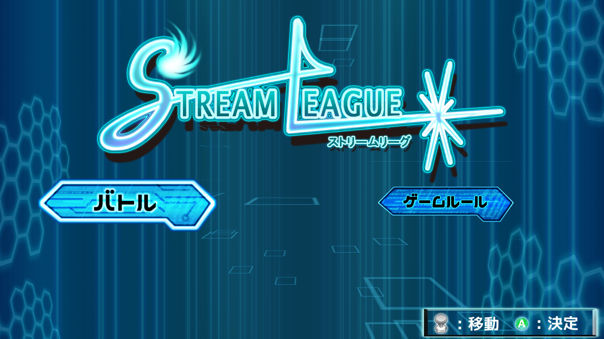

# Stream League

--------------------------

## 開発詳細
**<開発環境>**  
Unity5.3.5

**<制作人数>**  
9人  
プランナー：1人  
プログラマー：3人  
デザイナー：2人  
エフェクター：1人  
サウンド：2人  

メインプログラマーを担当

**<制作期間>**  
3ヵ月

--------------------------

## ゲームの起動方法
「就活」フォルダの中に「ゲーム.7z」か「ゲーム.rar」を解凍後、実行ファイルをダブルクリックで起動できます。

--------------------------

## ルール
[コーティングルール][Wiki]

[HP]:http://awards.cesa.or.jp/cat/cat_03.html
[Wiki]:https://github.com/ooHIROoo/GameAwards2016/wiki
